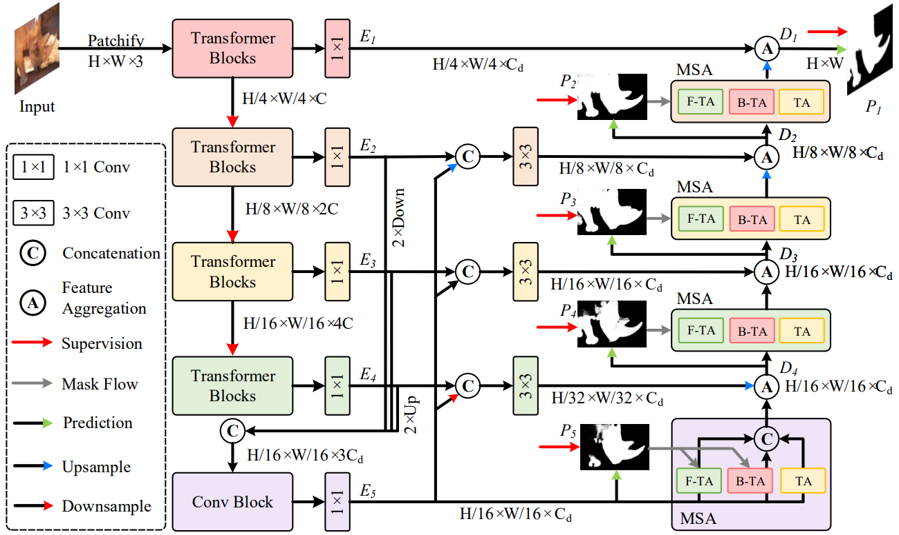
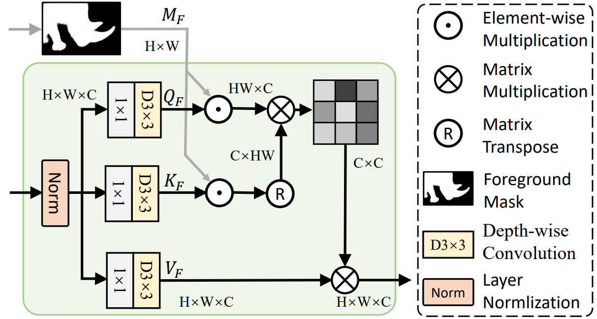
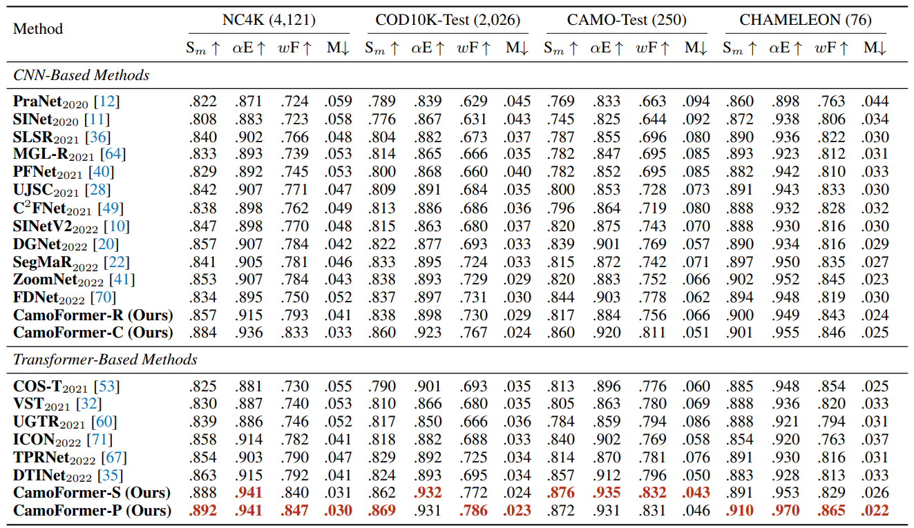

# <p align=center>`CamoFormer: Masked Separable Attention for Camouflaged Object Detection`</p>

> **Authors:**
> [Bowen Yin](http://yinbowen-chn.github.io/),
> [Xuying Zhang](),
> [Qibin Hou](),
> [Bo-Yuan Sun](),
> [Deng-Ping Fan](https://dengpingfan.github.io/), &
> [Luc Van Gool](https://ee.ethz.ch/the-department/faculty/professors/person-detail.OTAyMzM=.TGlzdC80MTEsMTA1ODA0MjU5.html).

This official repository contains the source code, prediction results, and evaluation toolbox of paper 'CamoFormer: Masked Separable Attention for Camouflaged Object Detection'. The technical report could be found at [arXiv](https://arxiv.org/abs/). 
The whole benchmark results can be found at [One Drive](https://mailnankaieducn-my.sharepoint.com/:f:/g/personal/bowenyin_mail_nankai_edu_cn/EmB36EZb_fdMvWGgKx2EalgBuQnj8AFifyR-ip7Jtkfwqg?e=nu6DJz), [Baidu Netdisk](https://pan.baidu.com/s/1k5CxYzcgizzJ4sRdAxBNlA?pwd=srtf), or [Google Drive](https://drive.google.com/drive/folders/1gsCeYtS9cwsMpTHQzkx81n4jsRK4LYdf?usp=sharing).
Code will be released soon.


## 1. :fire: NEWS :fire:

- [2022/12/08] Releasing the whole COD benchmarking results (21 models).
- [2022/12/08] Creating repository.

> We invite all to contribute in making it more acessible and useful. If you have any questions about our work, feel free to contact me via e-mail (bowenyin@mail.nankai.edu.cn). If you are using our code and evaluation toolbox for your research, please cite this paper ([BibTeX]()).

## 2. Get Start

**0. Install**

You could refer to [here](https://github.com/HVision-NKU/CamoFormer/blob/main/figs/Install.md).

**1. Download Datasets and Checkpoints.**

- **Datasets:** 

By default, you can put datasets into the folder 'dataset'.

[Baidu Netdisk](https://pan.baidu.com/s/1Tcvt0IJYdKSYAb_BD5QrTg?pwd=2gf4)

- **Checkpoints:** 

By default, you can put datasets into the folder 'checkpoint'.

CamoFormer: [Baidu Netdisk](https://pan.baidu.com/s/1QyE_HkxCp9vWlhnJAx20dQ?pwd=f4bp)
Backbone: [Baidu Netdisk](https://pan.baidu.com/s/1E10fb4_Gr08_6LV6AdyhSg?pwd=pgdk)

**2. Train CamoFormer.**
```
bash train.sh
```

**3. Test and Eval.**
```
bash test_eval.sh
```


## 3. Proposed CamoFormer

### 3.1. Overview

<p align="center">
     <br />
    <em> 
    Figure 1: Overall architecture of our CamoFormer model. First, a pretrained Transformer-based backbone is utilized to extract multi-scale features of the input image. Then, the features from the last three stages are aggregated to generate the coarse prediction. Next, the
progressive refinement decoder equipped with masked separable attention (MSA) is applied to gradually polish the prediction results. All
the predictions generated by our CamoFormer are supervised by the ground truth (GT).
    </em>
</p>


<p align="center">
     <br />
    <em> 
    Figure 2: Diagrammatic details of the proposed F-TA in our MSA. Our B-TA shares a similar structure except for the mask.
    </em>
</p>


### 3.2 COD Benchmark Results:

The prediction of our CamoFprmer can be found in [One Drive](https://mailnankaieducn-my.sharepoint.com/:f:/g/personal/bowenyin_mail_nankai_edu_cn/EmB36EZb_fdMvWGgKx2EalgBuQnj8AFifyR-ip7Jtkfwqg?e=nu6DJz), [Baidu Netdisk](https://pan.baidu.com/s/1k5CxYzcgizzJ4sRdAxBNlA?pwd=srtf), or [Google Drive](https://drive.google.com/drive/folders/1gsCeYtS9cwsMpTHQzkx81n4jsRK4LYdf?usp=sharing). Here are quantitative performance comparison.

<p align="center">
     <br />
    <em> 
    Figure 3: Comparison of our CamoFormer with the recent SOTA methods. ‘-R’: ResNet, ‘-C’: ConvNext, ‘-S’: Swin Transformer, ‘-P’: PVTv2. As can be seen, our CamoFormer-P performs much better than previous methods with either CNN- or
Transformer-based models. ‘↑’: the higher the better, ‘↓’: the lower the better.
    </em>

</p>


